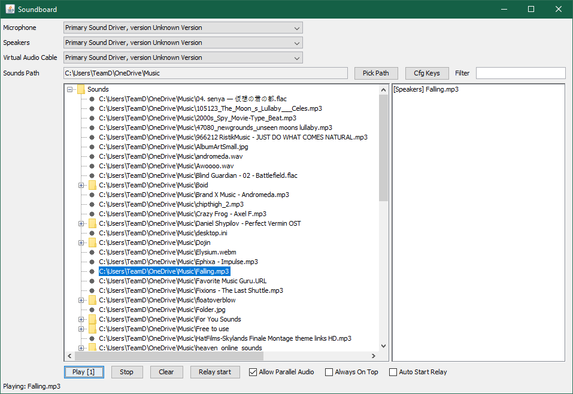

# AudioCable

A java-based soundboard app capable of relaying a microphone to a virtual audio cable

Requires 

         jl1.0.1.jar
         jnativehook-2.1.0.jar
         mp3spi1.9.5.jar
         tritonus_share.jar